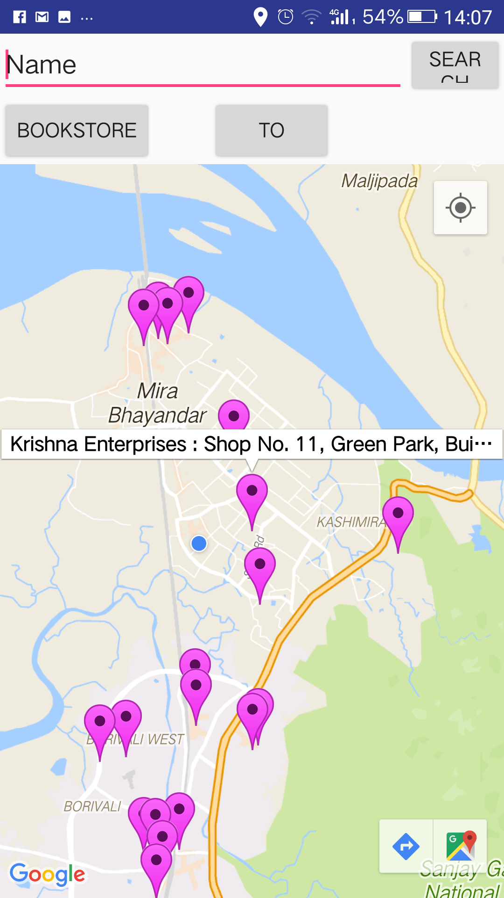
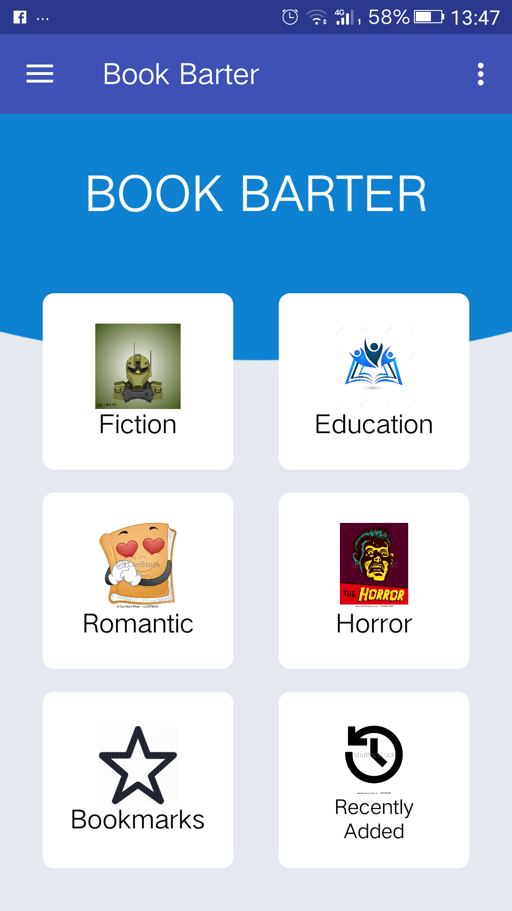
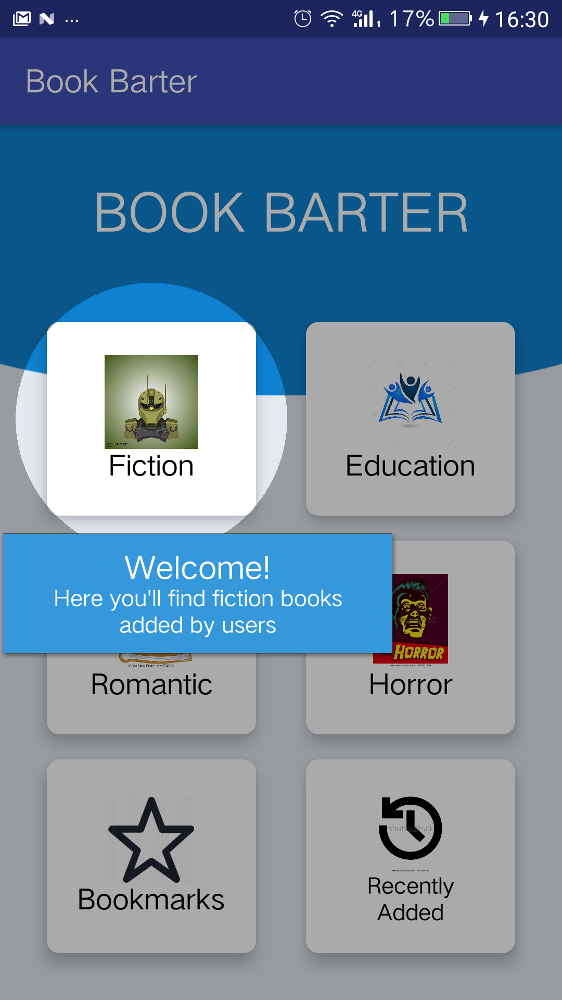
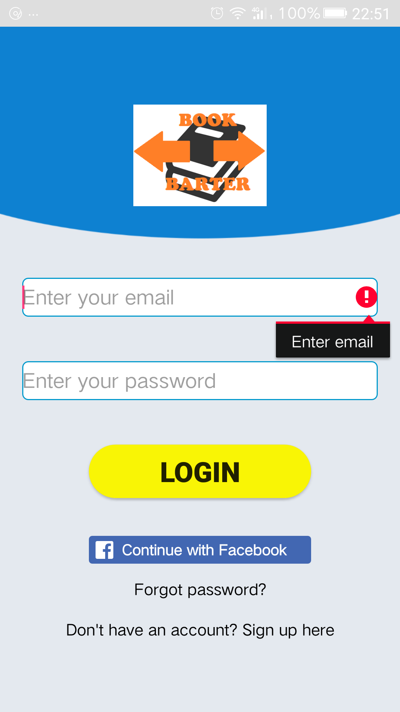

# BookBarter
BookBarter is an application where users can buy or borrow paperbacks via
email/sms and transaction .Users also have the choice to chat with other user’s and post
their query.
This application solely focuses on paperbacks.Nowadays people are more
into online technology ,that they read e-books and pdf .This application
focuses on those people who love having paperback at their disposal.Some
people just love the rustic smell of the old books .
Users have the option of browsing nearby location where it will display all
the nearby bookstores and direct you to google maps.The user can maintain
his/her profile,add books ,
Edit books,View books,search books,post reviews and view reviews.
The user can view all the recently added books.While adding books the user
is given an option to categorize his/her book

   
